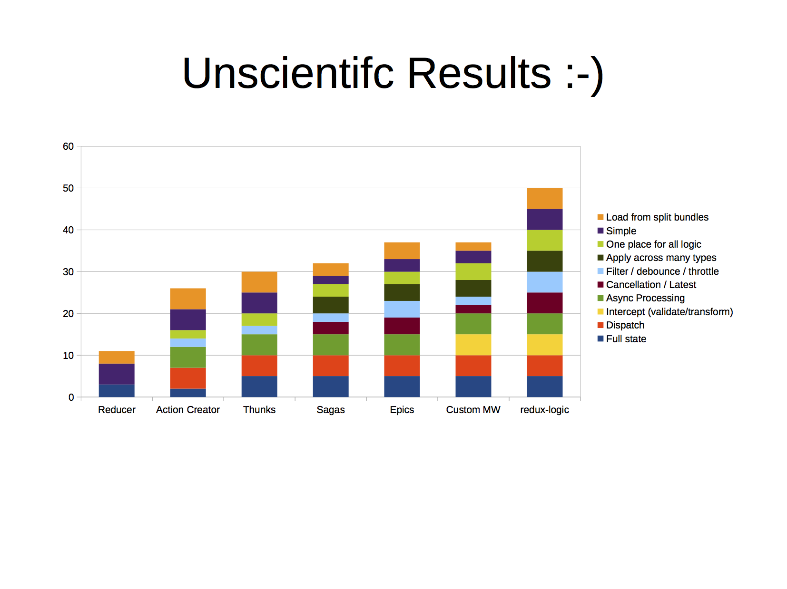

# Reducing Redux: Roll your own state management

---

# Should I use Redux?

---

# Why Redux Exists

> I wrote Redux...to implement logging, hot reloading, time travel, universal apps, record and replay, without any buy-in from the developer.
-- Dan Abramov

---

# Evil and its roots

> ...premature optimization is the root of all evil.
-- Sir Tony Hoare

---

# Evil and its roots

> Using the wrong tool for the job is the root of all evil.
-- Me

---

# The Three Principles of Redux

1. Single source of truth
2. State is read-only
3. Changes are made with pure functions

---

# Principle 1: Single source of truth

> The state of your whole application is stored in an object tree within a single store.

---

# Object tree

```javascript
{
  app: {
    offline: true
  },
  views: {
    sort: 'name' 
  },
  preferences: {
    theme: 'dark'
  },
  users: []
}
```

---

# createStore()

```javascript
function createStore(reducer) {
    var state;
    var listeners = []

    function getState() {
        return state
    }
    
    function subscribe(listener) {
        listeners.push(listener)
        return unsubscribe() {
            var index = listeners.indexOf(listener)
            listeners.splice(index, 1)
        }
    }
    
    function dispatch(action) {
        state = reducer(state, action)
        listeners.forEach(listener => listener())
    }

    dispatch({})

    return { dispatch, subscribe, getState }
}
```

---

# createStore()

```javascript
function createStore(reducer) {
  const state = reducer({}, {});
  
  return action => {
    state = reducer(state, action)
    
    return state
  }
}

const store = createStore(reducer) 
const nextState = store({type: 'ADD'}) // dispatch()
const currentState = store({}) // getState()
```

---

# Principle 2: State is read-only

> The only way to change the state is to emit an action, an object describing what happened.

---

# "Emitting" an "action"

```javascript
const action = {type: 'ADD', payload: 'totally optional'}
store.dispatch(action)
```

---

# Action creators and encapsulation

```javascript
const addUser = (first, last) => {
  const name = `${first} ${last}`
  
  return {
    type: 'ADD_USER',
    payload: {name}
  }
}
```

---

# Principle 3: Changes are made with pure functions

> To specify how the state tree is transformed by actions, you write pure reducers.

---

# Function purity

```javascript
function pure(a, b) {
  return a + b
}

function impure(a, b) {
  return new Date(a)
}

async function impureRequest(url) {
  return await fetch(url)
}
```

---

# What's a reducer?

```javascript
const reducer = (state, action) => state
```

---

# reduce()

^ Eric Elliott explanation

```javascript
[].reduce(reducer, initialState)

const reducer = (accumulator, value) => newAccumulator

const initialState = 0 // or {}, [], '', etc


const initialState = 0
const add = (a, b) => a + b

[1, 2, 3].reduce(add, 0) // 6


const actions = [
  { type: 'ADD', payload: 1 },
  { type: 'ADD', payload: 2 },
  { type: 'ADD', payload: 3 }
]

const reducer = (state, action) => {total: state.total + action.payload}

actions.reduce(reducer, {total: 0}) // {total: 6}
```

---

# combineReducers()

```javascript
const reducers = {
  users: reduceUsers,
  comments: reduceComments
}

function combineReducers(reducers) {
  var reducerKeys = Object.keys(reducers)

  return function combination(state, action) {
    var nextState = {}

    reducerKeys.forEach(key => {
      const reducer = reducers[key]

      nextState[key] = reducer(state[key], action)
    })

    return nextState;
  }
}

const reducer = combineReducers(reducers)
```

^ Modular, separates concerns, scales. If you need to add another branch to your state tree, it's just a matter of adding another reducer when you combine them. This isn't really life-changing, but it's a useful feature.

^ And that's it for the three principles. We're done. You now understand all the underlying concepts of redux. Single source of truth, state is read-only, changes are pure functions.

---

# Middleware and what Redux is not

> [Thunks were] literally the "I hope people will come up with something better" solution, didn't expect it to catch on so much
-- Dan Abramov



---

# Redux reduces to

- Object tree
- Single source of truth
- Encapsulation
- Partial application
- Pure functions
- Determinism
- Reduce

---

# Sources

- http://redux.js.org/
- http://blog.isquaredsoftware.com/2017/05/idiomatic-redux-tao-of-redux-part-1/
- http://codewinds.com/blog/2016-11-20-nodevember-redux-logic.html
- http://argelius.github.io/react-onsenui-redux-weather/
- https://medium.com/javascript-scene/10-tips-for-better-redux-architecture-69250425af44

---

# "You ~~Might Not~~ Probably Don't Need Redux"

Every tool you add to your project comes with a price: complexity

Good design is knowing the price of your tools and how to weigh the costs against the benefits

---

# Please clap
